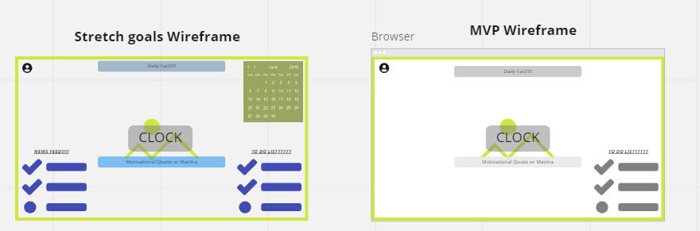
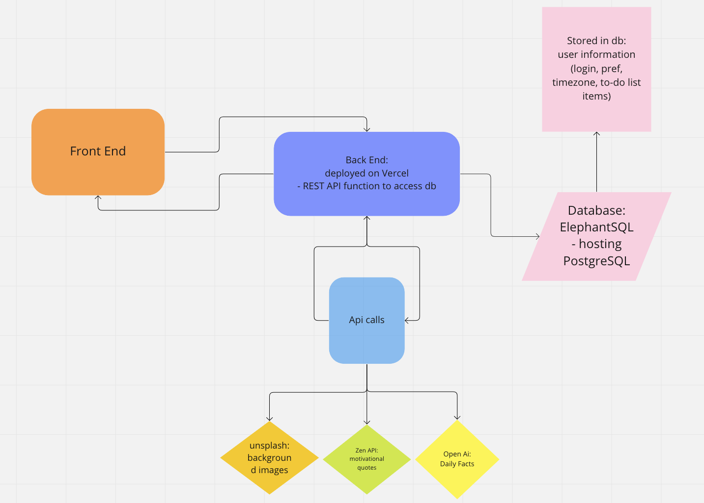
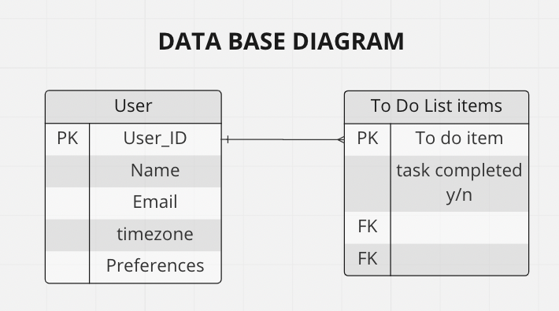

# Project: ThriveHQ

---

### We are deployed on Vercel

[project url here]

---

## Web Application

[//]: # (***[Explain your app, should be at least a paragraph. What does it do? Why should I use? Sell your product!]***)

The goal of our app is to create a simple aesthetic interface to help user's stay focused, motivated, and on task. We used a combination of Tailwind and React to create a clean and easy to navigate user experience that reduces stress to help accomplish their goals. We added a Django backend to store user information and make api calls for quick, error free functionality.

---

## Authors

- Matthew Gebhart
- Don Choi
- Monica Ramirez
- Gordon Reilley Jr.

---

## Tools Used

VS Code
PyCharm

- Python
- Docker
- JavaScript
- React
- Next.JS
- Django
- Tailwind
- Pytest

---

## Trello Board & Software Requirements

- [Trello Board](https://trello.com/b/YEqZKZcf/thrivehq-hq)
- [Software Requirements](./project_prep/requirements.md)

---

## Recent Updates

#### V 1.0

*Added README and Team Agreement* - 20 FEB 2023

---

## Getting Started

Clone this repository to your local machine.

```
git clone https://github.com/YourRepo/YourProject.git
```

Once downloaded, activate your virtual environment and run by ____________

```
cd YourRepo/YourProject
python xxx.py
```

The poetry tools will automatically install any dependencies. Before running the application, setup your DB by doing ________

```
Update-Database
```

Once the database has been created, the application can be run. Options for running and debugging the application using can be found via your coding tools of ___________. From the command line, the following will start an instance of the Postgresql server to host the application:

```
cd YourRepo/YourProject
dotnet run
```

Unit testing is included in the __________________ project using the pytest test framework. Tests have been provided for models, view models, controllers, and utility classes for the application.

---

## Usage

***[Provide some images of your app with brief description as title]***

### Overview of Recent Posts


---

## Data Flow





---

## Data Model

### Overall Project Schema

***[Add a description of your DB schema. Explain the relationships to me.]***


---

## Change Log

***[The change log will list any changes made to the code base. This includes any changes from TA/Instructor feedback]***

---

For more information on Markdown: <https://www.markdownguide.org/cheat-sheet>
