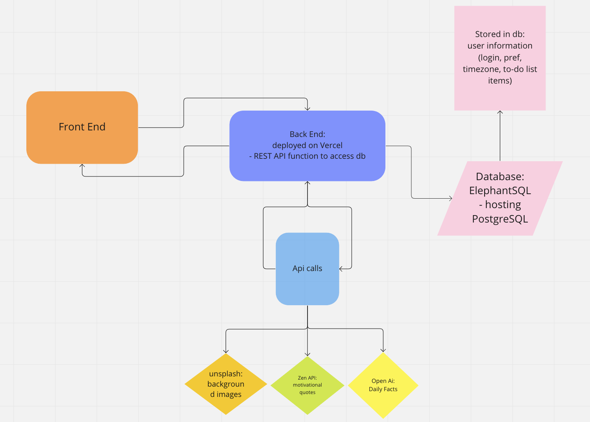

# Software Requirements

---

## Vision

### What is the vision of this product?

The goal of our app is to create a simple aesthetic interface to help user's stay focused, motivated, and on task. We used a combination of Tailwind and React to create a clean and easy to navigate user experience that reduces stress to help accomplish their goals. We added a Django backend to store user information and make api calls for quick, error free functionality.

### What pain point does this project solve?

Life is busy and can be overwhelming. Our app can help people navigate their daily goals by providing inspiration, information, and tools in one simple, easy to access location. Help the user stay organized and productive.

### Why should we care about your product?

Having easy access to the things we use most in our daily lives is essential to being productive. Our app does this by keeping you organized and motivated without being cumbersome.

## Scope (In/Out)

>IN

* This app will provide the user with the ability to add tasks to a "to-do" list.
* This app will provide motivational quotes to encourage focus and productivity while using the app.
* This app will provide daily facts to further the knowledge of user.
* This app will give user easy access to a clock for time management.

>OUT

* This app will not be a IOS/Android app.

## Minimum Viable Product

### What will your MVP functionality be?

A deployed website that stores user profiles and their task list in an overall aesthetic package. The app will have authentication and login/logout functionality as well as a clock, motivational quote, and daily facts.

### What are your stretch goals?

* Make it a chrome extension instead of a website
* Calender
* News feed

## Functional Requirements

* An admin can create and delete user accounts
* A user can update their profile information
* A user can CRUD there "To-Do" list items

## Data Flow

## Non-functional requirements

* **Usability**
  * Motivational quotes
  * Easily viewed clock
  * Daily fact
  * Inspirational background

* **Testability**
  * We will use pytest for testing our application.
  * We follow principles of test driven development